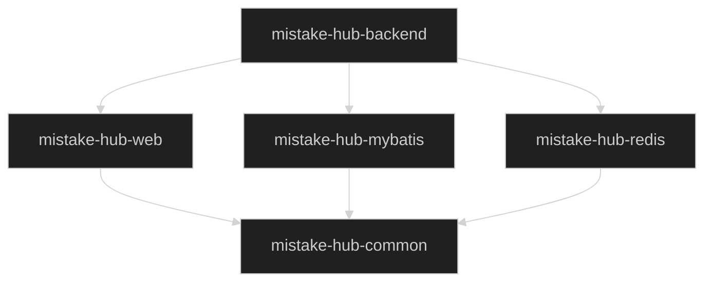

# Mistake-Hub 项目架构方案

## 一、当前项目结构

```
mistake-hub/
├── pom.xml                    # 根 POM (聚合模块)
├── dependencies/
│   └── pom.xml               # BOM 依赖版本管理
├── framework/
│   └── pom.xml               # 框架模块 (当前为空)
└── backend/
    └── pom.xml               # 业务模块
```

**技术栈**: Spring Boot 3.4.3 + Java 17 + MyBatis Plus 3.5.10.1 + MySQL 8

---

## 二、依赖版本问题

| 问题 | 位置 | 当前值 | 建议 |
|------|------|--------|------|
| mysql-connector-j 硬编码版本 | `backend/pom.xml:64` | 9.2.0 | 移入 `dependencies/pom.xml` 统一管理 |
| redisson 硬编码版本 | `backend/pom.xml:70` | 3.21.3 | 已在 dependencies 定义，删除 backend 中的 version 标签 |
| jjwt 与 Java 17 不兼容 | `dependencies/pom.xml:18` | 0.9.1 | 升级到 0.12.6 (新 API 结构) |
| hutool 版本不一致 | dependencies vs backend 注释 | 5.8.27 vs 5.8.38 | 统一为 5.8.38 |
| redisson 版本较旧 | `dependencies/pom.xml:29` | 3.21.3 | 建议升级到 3.36.0+ |

### 2.1 jjwt 升级说明

jjwt 0.9.1 依赖 `javax.xml.bind:jaxb-api`，Java 17 已移除该包。

**0.12.x 新依赖结构**:
```xml
<dependency>
    <groupId>io.jsonwebtoken</groupId>
    <artifactId>jjwt-api</artifactId>
    <version>0.12.6</version>
</dependency>
<dependency>
    <groupId>io.jsonwebtoken</groupId>
    <artifactId>jjwt-impl</artifactId>
    <version>0.12.6</version>
    <scope>runtime</scope>
</dependency>
<dependency>
    <groupId>io.jsonwebtoken</groupId>
    <artifactId>jjwt-jackson</artifactId>
    <version>0.12.6</version>
    <scope>runtime</scope>
</dependency>
```

---

## 三、Framework 模块设计方案

### 3.1 模块结构

```
mistake-hub-framework/
├── pom.xml                           # 聚合父 POM (packaging: pom)
│
├── mistake-hub-common/               # 通用基础模块
│   ├── pom.xml
│   └── src/main/java/.../common/
│       ├── constant/                 # 常量定义
│       ├── enums/                    # 枚举类
│       ├── exception/                # 业务异常 (BizException, ErrorCode)
│       └── result/                   # 统一响应 (Result<T>)
│
├── mistake-hub-web/                  # Web 层模块
│   ├── pom.xml
│   └── src/main/java/.../web/
│       ├── handler/                  # 全局异常处理器
│       ├── interceptor/              # 拦截器 (链路追踪)
│       └── config/                   # Web 配置
│
├── mistake-hub-mybatis/              # 数据层模块
│   ├── pom.xml
│   └── src/main/java/.../mybatis/
│       ├── base/                     # BaseDO (id, createTime, updateTime)
│       ├── config/                   # MyBatis Plus 配置
│       └── handler/                  # 类型处理器
│
└── mistake-hub-redis/                # Redis 工具模块
    ├── pom.xml
    └── src/main/java/.../redis/
        ├── lock/                     # 分布式锁
        ├── idempotent/               # 幂等控制
        └── ratelimit/                # 限流
```

### 3.2 模块依赖关系



### 3.3 各模块职责

| 模块 | 职责 | 核心类 |
|------|------|--------|
| common | 零依赖基础类 | Result, BizException, ErrorCode |
| web | Web 层增强 | GlobalExceptionHandler, TraceInterceptor |
| mybatis | 数据层增强 | BaseDO, MybatisPlusConfig |
| redis | 分布式工具 | DistributedLock, IdempotentAspect |

---

## 四、操作步骤清单

### Step 1: 修改 `dependencies/pom.xml`

```xml
<properties>
    <!-- 更新版本 -->
    <jjwt.version>0.12.6</jjwt.version>
    <hutool-all.version>5.8.38</hutool-all.version>
    <redisson.version>3.36.0</redisson.version>

    <!-- 新增 -->
    <mysql-connector.version>9.2.0</mysql-connector.version>
</properties>

<dependencyManagement>
    <dependencies>
        <!-- 新增 mysql-connector-j -->
        <dependency>
            <groupId>com.mysql</groupId>
            <artifactId>mysql-connector-j</artifactId>
            <version>${mysql-connector.version}</version>
        </dependency>

        <!-- 替换旧 jjwt -->
        <dependency>
            <groupId>io.jsonwebtoken</groupId>
            <artifactId>jjwt-api</artifactId>
            <version>${jjwt.version}</version>
        </dependency>
        <dependency>
            <groupId>io.jsonwebtoken</groupId>
            <artifactId>jjwt-impl</artifactId>
            <version>${jjwt.version}</version>
        </dependency>
        <dependency>
            <groupId>io.jsonwebtoken</groupId>
            <artifactId>jjwt-jackson</artifactId>
            <version>${jjwt.version}</version>
        </dependency>
    </dependencies>
</dependencyManagement>
```

### Step 2: 修改 `backend/pom.xml`

```xml
<!-- 移除硬编码版本 -->
<dependency>
    <groupId>com.mysql</groupId>
    <artifactId>mysql-connector-j</artifactId>
    <!-- 删除 <version>9.2.0</version> -->
</dependency>

<dependency>
    <groupId>org.redisson</groupId>
    <artifactId>redisson-spring-boot-starter</artifactId>
    <!-- 删除 <version>3.21.3</version> -->
</dependency>
```

### Step 3: 改造 `framework/pom.xml`

```xml
<?xml version="1.0" encoding="UTF-8"?>
<project xmlns="http://maven.apache.org/POM/4.0.0"
         xmlns:xsi="http://www.w3.org/2001/XMLSchema-instance"
         xsi:schemaLocation="http://maven.apache.org/POM/4.0.0
         https://maven.apache.org/xsd/maven-4.0.0.xsd">
    <modelVersion>4.0.0</modelVersion>

    <parent>
        <groupId>com.jianzj.mistake.hub</groupId>
        <artifactId>mistake-hub-all</artifactId>
        <version>0.0.1-SNAPSHOT</version>
    </parent>

    <artifactId>mistake-hub-framework</artifactId>
    <packaging>pom</packaging>

    <modules>
        <module>mistake-hub-common</module>
        <module>mistake-hub-web</module>
        <module>mistake-hub-mybatis</module>
        <module>mistake-hub-redis</module>
    </modules>

</project>
```

### Step 4: 创建子模块目录结构

```bash
# 创建 4 个子模块
mkdir -p framework/mistake-hub-common/src/main/java/com/jianzj/mistake/hub/common
mkdir -p framework/mistake-hub-web/src/main/java/com/jianzj/mistake/hub/web
mkdir -p framework/mistake-hub-mybatis/src/main/java/com/jianzj/mistake/hub/mybatis
mkdir -p framework/mistake-hub-redis/src/main/java/com/jianzj/mistake/hub/redis
```

### Step 5: 创建各子模块 pom.xml

**framework/mistake-hub-common/pom.xml**:
```xml
<?xml version="1.0" encoding="UTF-8"?>
<project xmlns="http://maven.apache.org/POM/4.0.0"
         xmlns:xsi="http://www.w3.org/2001/XMLSchema-instance"
         xsi:schemaLocation="http://maven.apache.org/POM/4.0.0
         https://maven.apache.org/xsd/maven-4.0.0.xsd">
    <modelVersion>4.0.0</modelVersion>

    <parent>
        <groupId>com.jianzj.mistake.hub</groupId>
        <artifactId>mistake-hub-framework</artifactId>
        <version>0.0.1-SNAPSHOT</version>
    </parent>

    <artifactId>mistake-hub-common</artifactId>

    <dependencies>
        <dependency>
            <groupId>org.projectlombok</groupId>
            <artifactId>lombok</artifactId>
            <optional>true</optional>
        </dependency>
    </dependencies>

</project>
```

**framework/mistake-hub-web/pom.xml**:
```xml
<?xml version="1.0" encoding="UTF-8"?>
<project xmlns="http://maven.apache.org/POM/4.0.0"
         xmlns:xsi="http://www.w3.org/2001/XMLSchema-instance"
         xsi:schemaLocation="http://maven.apache.org/POM/4.0.0
         https://maven.apache.org/xsd/maven-4.0.0.xsd">
    <modelVersion>4.0.0</modelVersion>

    <parent>
        <groupId>com.jianzj.mistake.hub</groupId>
        <artifactId>mistake-hub-framework</artifactId>
        <version>0.0.1-SNAPSHOT</version>
    </parent>

    <artifactId>mistake-hub-web</artifactId>

    <dependencies>
        <dependency>
            <groupId>com.jianzj.mistake.hub</groupId>
            <artifactId>mistake-hub-common</artifactId>
            <version>${project.version}</version>
        </dependency>
        <dependency>
            <groupId>org.springframework.boot</groupId>
            <artifactId>spring-boot-starter-web</artifactId>
        </dependency>
        <dependency>
            <groupId>org.projectlombok</groupId>
            <artifactId>lombok</artifactId>
            <optional>true</optional>
        </dependency>
    </dependencies>

</project>
```

**framework/mistake-hub-mybatis/pom.xml**:
```xml
<?xml version="1.0" encoding="UTF-8"?>
<project xmlns="http://maven.apache.org/POM/4.0.0"
         xmlns:xsi="http://www.w3.org/2001/XMLSchema-instance"
         xsi:schemaLocation="http://maven.apache.org/POM/4.0.0
         https://maven.apache.org/xsd/maven-4.0.0.xsd">
    <modelVersion>4.0.0</modelVersion>

    <parent>
        <groupId>com.jianzj.mistake.hub</groupId>
        <artifactId>mistake-hub-framework</artifactId>
        <version>0.0.1-SNAPSHOT</version>
    </parent>

    <artifactId>mistake-hub-mybatis</artifactId>

    <dependencies>
        <dependency>
            <groupId>com.jianzj.mistake.hub</groupId>
            <artifactId>mistake-hub-common</artifactId>
            <version>${project.version}</version>
        </dependency>
        <dependency>
            <groupId>com.baomidou</groupId>
            <artifactId>mybatis-plus-boot-starter</artifactId>
        </dependency>
        <dependency>
            <groupId>org.projectlombok</groupId>
            <artifactId>lombok</artifactId>
            <optional>true</optional>
        </dependency>
    </dependencies>

</project>
```

**framework/mistake-hub-redis/pom.xml**:
```xml
<?xml version="1.0" encoding="UTF-8"?>
<project xmlns="http://maven.apache.org/POM/4.0.0"
         xmlns:xsi="http://www.w3.org/2001/XMLSchema-instance"
         xsi:schemaLocation="http://maven.apache.org/POM/4.0.0
         https://maven.apache.org/xsd/maven-4.0.0.xsd">
    <modelVersion>4.0.0</modelVersion>

    <parent>
        <groupId>com.jianzj.mistake.hub</groupId>
        <artifactId>mistake-hub-framework</artifactId>
        <version>0.0.1-SNAPSHOT</version>
    </parent>

    <artifactId>mistake-hub-redis</artifactId>

    <dependencies>
        <dependency>
            <groupId>com.jianzj.mistake.hub</groupId>
            <artifactId>mistake-hub-common</artifactId>
            <version>${project.version}</version>
        </dependency>
        <dependency>
            <groupId>org.redisson</groupId>
            <artifactId>redisson-spring-boot-starter</artifactId>
        </dependency>
        <dependency>
            <groupId>org.springframework.boot</groupId>
            <artifactId>spring-boot-starter-aop</artifactId>
        </dependency>
        <dependency>
            <groupId>org.projectlombok</groupId>
            <artifactId>lombok</artifactId>
            <optional>true</optional>
        </dependency>
    </dependencies>

</project>
```

### Step 6: 验证构建

```bash
cd /Users/jianzj/Code/mistake-hub
mvn clean install -DskipTests
mvn dependency:tree -pl backend
```

---

## 五、完成后的项目结构

```
mistake-hub/
├── pom.xml
├── dependencies/
│   └── pom.xml
├── framework/
│   ├── pom.xml                       # 聚合 POM
│   ├── mistake-hub-common/
│   │   ├── pom.xml
│   │   └── src/main/java/...
│   ├── mistake-hub-web/
│   │   ├── pom.xml
│   │   └── src/main/java/...
│   ├── mistake-hub-mybatis/
│   │   ├── pom.xml
│   │   └── src/main/java/...
│   └── mistake-hub-redis/
│       ├── pom.xml
│       └── src/main/java/...
└── backend/
    ├── pom.xml
    └── src/main/java/...
```

---

## 六、后续开发建议

1. **优先实现 common 模块**: Result, BizException, ErrorCode
2. **其次实现 web 模块**: GlobalExceptionHandler
3. **按需实现其他模块**: mybatis/redis 根据业务需求逐步添加
